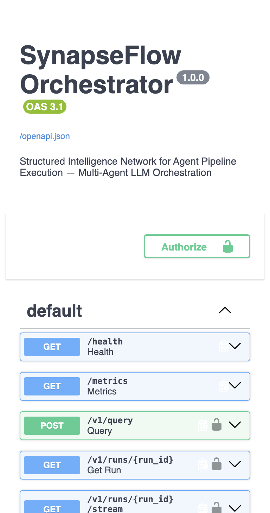
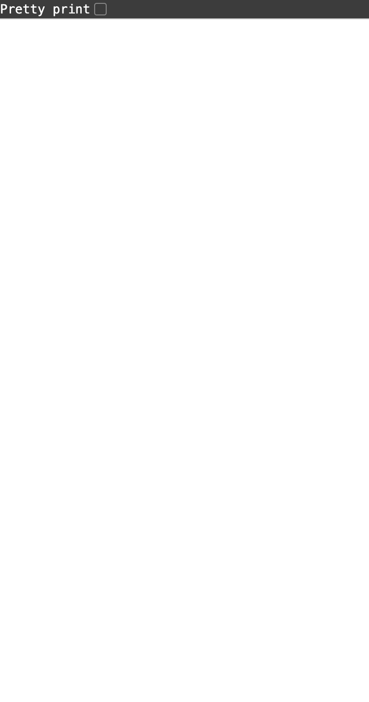
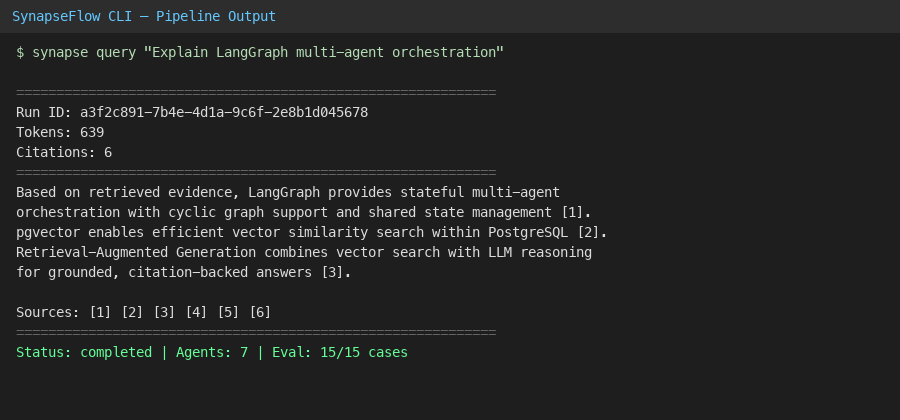

# SynapseFlow — Structured Intelligence Network for Agent Pipeline Execution

**Production-grade multi-agent LLM orchestration platform** engineered for reliable, observable, and scalable agent pipeline execution.

SynapseFlow coordinates **8 specialized agents** through a stateful DAG-based architecture with **2-hop RAG, critique-driven synthesis, automatic context compression, failure recovery, cost-aware model routing, and human-in-the-loop prompt optimization**.

<p align="center">
  <a href="https://github.com/Prabhat-190/synapse-flow-/actions/workflows/ci.yml"></a>
  
  
  
</p>

## Demo

| Swagger UI | Health Check | CLI Output |
|:---:|:---:|:---:|
|  |  |  |

> **PDF Notes:** [docs/SynapseFlow_Notes.pdf](docs/SynapseFlow_Notes.pdf) | **Architecture:** [docs/ARCHITECTURE.md](docs/ARCHITECTURE.md)

## Architecture

```text
                         ┌──────────────────────────────┐
                         │        FastAPI Gateway       │
                         │ Auth • Rate Limits • SSE     │
                         │ Injection Defense            │
                         └──────────────┬───────────────┘
                                        │
                         ┌──────────────▼───────────────┐
                         │      LangGraph Orchestrator  │
                         │   Stateful DAG Execution     │
                         └──────────────┬───────────────┘
                                        │
        ┌───────────────────────────────┼────────────────────────────┐
        │                               │                            │
        ▼                               ▼                            ▼
 Orchestrator → Decomposition → Retrieval (2-Hop RAG)         Blackboard
        │                               │                            │
        ▼                               ▼                            │
   Reasoning ───────────────→ Critique ───────────────→ Synthesis    │
        │                     Span Scoring               │            │
        │                     RESOLVE/REMOVE/HEDGE       │            │
        ▼                                                  ▼         │
 Compression Agent                                  Final Response  │
        │                                                             │
        └──────────────────────→ Meta Agent ←─────────────────────────┘
                                  │
                           Prompt Rewrites
                           Human Approval Gate

        ┌───────────────────────────────────────────────────────────┐
        │              Reliability & Infrastructure Layer            │
        │ PostgreSQL/pgvector • Redis • Celery • Circuit Breakers    │
        │ Retry/Recovery • Semantic Cache • Cost-Aware Routing       │
        └───────────────────────────────────────────────────────────┘
```

## Core Features

| Feature                        | Description                                                                                             |
| ------------------------------ | ------------------------------------------------------------------------------------------------------- |
| **8-Agent Pipeline**           | Orchestrator, Decomposition, Retrieval, Reasoning, Critique, Synthesis, Compression and Meta agents     |
| **Stateful DAG Execution**     | Dynamic subtask decomposition with conditional routing and dependency-aware execution                   |
| **Shared Blackboard**          | Thread-safe execution state containing subtasks, citations, spans, provenance and intermediate results  |
| **2-Hop RAG**                  | pgvector similarity retrieval followed by document-link expansion for improved multi-hop recall         |
| **Critique → Synthesis**       | Span-level evaluation with RESOLVE, REMOVE and HEDGE actions before final synthesis                     |
| **Never-Silent-Truncation**    | Token budget overflow triggers intelligent context compression instead of silently dropping information |
| **Fault-Tolerant Execution**   | Retries, circuit breakers, deterministic fallbacks and resumable pipeline execution                     |
| **Cost-Aware Model Routing**   | Routes workloads based on task complexity, latency requirements, token budget and model availability    |
| **Human-in-the-Loop**          | Meta agent proposes prompt improvements while requiring explicit human approval before deployment       |
| **Prompt Injection Defense**   | Pattern, heuristic and policy-based screening for direct and indirect injection attempts                |
| **Semantic Caching**           | Reuses equivalent LLM/RAG computations to reduce latency and inference cost                             |
| **SSE Streaming**              | Real-time agent execution states, intermediate results and pipeline events                              |
| **Distributed Task Execution** | Celery + Redis workers for asynchronous and isolated pipeline execution                                 |
| **Execution Recovery**         | Failed pipelines can resume from the last successfully completed agent                                  |
| **Evaluation Harness**         | 100+ baseline, ambiguous and adversarial cases with independent model-based judging                     |
| **Load Testing**               | Concurrent workload benchmarking with p50/p95/p99 latency, throughput and failure-rate measurements     |
| **Observability**              | Prometheus metrics, structured logging and OpenTelemetry-compatible distributed traces                  |
| **Cost & Latency Analytics**   | Per-run and per-agent token usage, inference cost, latency and failure analytics                        |

## Reliability Architecture

SynapseFlow treats LLM and infrastructure failures as expected conditions rather than exceptional cases.

```text
LLM Request
     │
     ▼
Circuit Breaker
     │
     ├── Success ──────────────→ Continue
     │
     └── Failure
          │
          ▼
        Retry
          │
          ▼
    Fallback Model
          │
          ▼
 Deterministic Fallback
```

Pipeline execution is checkpointed so that worker failures do not require restarting the complete workflow.

```text
Orchestrator ✓
      ↓
Decomposition ✓
      ↓
Retrieval ✓
      ↓
Reasoning ✗
      ↓
Worker failure
      ↓
Resume from Reasoning
```

## Evaluation Framework

SynapseFlow includes an automated evaluation framework comparing:

```text
Baseline LLM
      vs
Basic RAG
      vs
2-Hop RAG
      vs
SynapseFlow
```

Evaluation categories include:

* Correctness
* Faithfulness
* Citation precision
* Citation recall
* Hallucination rate
* Multi-hop reasoning
* Ambiguity handling
* Prompt-injection resistance
* Contradiction handling
* Context-budget handling
* Latency
* Token consumption
* Estimated inference cost

The benchmark contains **100+ test cases** spanning baseline, ambiguous and adversarial workloads.

```bash
make eval                    # 15 core cases (fast)
curl -X POST .../v1/eval/run?full=true  # full 100+ suite
```

## Observability

Every pipeline execution produces a correlated execution trace:

```text
Run #1842
│
├── Orchestrator       120ms
├── Decomposition      430ms
├── Retrieval          280ms
│   ├── Hop 1          100ms
│   └── Hop 2          180ms
├── Reasoning         2.1s
├── Critique           900ms
└── Synthesis          700ms

Total Latency: 4.53s
Tokens: 8,420
Estimated Cost: $0.014
```

Metrics are exposed through Prometheus (`/metrics`) and aggregated pipeline stats via `/v1/metrics`.

## Security

Security controls include:

* API key authentication
* Per-client rate limiting
* Prompt-injection screening at API boundary
* Input validation (Pydantic)
* Secure secret management via environment variables
* Request auditing via structured logs

## Technology Stack

**Backend:** Python, FastAPI, LangGraph, Pydantic

**AI:** Gemini, Embedding models, 2-Hop RAG, Semantic caching, Cost-aware model routing

**Data & Infrastructure:** PostgreSQL, pgvector, Redis, Celery, Docker

**Observability:** Prometheus, structlog, OpenTelemetry-ready

**Testing:** Pytest, Integration tests, Adversarial evaluation, Load testing

## Quick Start

```bash
git clone https://github.com/Prabhat-190/synapse-flow-.git
cd synapse-flow
python -m venv .venv && source .venv/bin/activate
make install

synapse query "Explain LangGraph multi-agent orchestration"
make serve          # http://127.0.0.1:8000/docs
make test
python scripts/load_test.py -n 10 -c 3
```

## Project Structure

```text
src/synapse/
├── agents/           # 8 agents + LangGraph pipeline
├── core/             # Blackboard, models, token budget
├── gateway/          # FastAPI app, security, SSE
├── infra/            # LLM router, circuit breaker, cache, DB, Redis, Celery
├── rag/              # Embeddings, 2-hop retrieval
├── eval/             # Datasets (100+ cases), harness, judges
└── observability/    # Metrics aggregation
```

## API

| Endpoint               | Method | Description                       |
| ---------------------- | ------ | --------------------------------- |
| `/v1/query`            | POST   | Execute multi-agent pipeline      |
| `/v1/runs/{id}`        | GET    | Retrieve execution trace          |
| `/v1/runs/{id}/stream` | GET    | Stream live agent events          |
| `/v1/runs/{id}/dag`    | GET    | Retrieve execution DAG            |
| `/v1/runs/{id}/resume` | POST   | Resume failed pipeline            |
| `/v1/rewrites/approve` | POST   | Approve Meta-agent prompt rewrite |
| `/v1/eval/run`         | POST   | Execute evaluation benchmark      |
| `/v1/metrics`          | GET    | Pipeline performance metrics      |
| `/health`              | GET    | Service health                    |
| `/metrics`             | GET    | Prometheus metrics                |

## Engineering Highlights

* Stateful multi-agent orchestration using a **dependency-aware execution DAG**
* Fault-tolerant LLM execution with **retry, circuit-breaker and fallback strategies**
* **Checkpoint-based recovery** for failed distributed pipelines
* Multi-hop retrieval using **pgvector + document graph expansion**
* Token-budget-aware context management with dedicated compression
* Real-time execution streaming using **Redis Pub/Sub + SSE**
* Per-agent **latency, token and cost observability**
* Automated adversarial evaluation for **quality and security regression testing**
* Containerized infrastructure with automated CI/CD
* Scalable asynchronous execution through **Celery workers**

## Production Engineering Goals

```text
Reliability      → retries + recovery + circuit breakers
Scalability      → async workers + Redis + horizontal execution
Quality          → critique + evaluation + citation validation
Security         → injection defense + rate limiting
Performance      → caching + model routing + parallel DAG tasks
Observability    → metrics + traces + structured logs
Cost Efficiency  → semantic cache + cost-aware routing
```

## Author

**Prabhat Kumar** — [@Prabhat-190](https://github.com/Prabhat-190)

## License

MIT — see [LICENSE](LICENSE).
