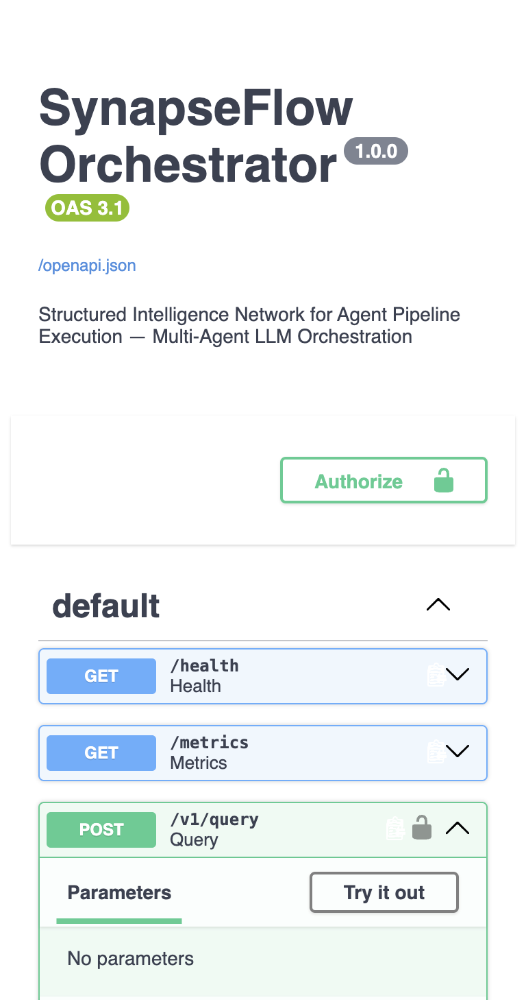

# SynapseFlow

**Structured Intelligence Network for Agent Pipeline Execution**

Production-grade multi-agent LLM orchestration platform featuring an 8-agent LangGraph pipeline, 2-hop RAG, critique-synthesis with provenance tracking, and a full evaluation harness.

<p align="center">
  <a href="https://github.com/Prabhat-190/synapse-flow-/actions/workflows/ci.yml"></a>
  
  
  
  
</p>

---

## Table of Contents

- [Overview](#overview)
- [Demo](#demo)
- [Architecture](#architecture)
- [Features](#features)
- [Quick Start](#quick-start)
- [API Reference](#api-reference)
- [Project Structure](#project-structure)
- [Evaluation](#evaluation)
- [Documentation](#documentation)
- [Tech Stack](#tech-stack)
- [Author](#author)
- [License](#license)

## Overview

SynapseFlow coordinates specialized AI agents through a **shared context blackboard**, routing queries across retrieval, reasoning, critique, and synthesis stages. It is designed for grounded, citation-backed answers with production concerns baked in: auth, rate limiting, prompt injection defense, observability, and budget-aware context compression.

**Problem:** Single LLM calls struggle with complex queries requiring retrieval, fact-checking, and structured decomposition.

**Solution:** A typed multi-agent pipeline where each agent owns a narrow responsibility, with deterministic fallbacks when LLM routing fails.

## Demo

### Swagger UI


### Health Check


### Query Endpoint


### CLI Pipeline Output


> **PDF Notes:** [docs/SynapseFlow_Notes.pdf](docs/SynapseFlow_Notes.pdf) | **Architecture:** [docs/ARCHITECTURE.md](docs/ARCHITECTURE.md)

## Architecture

```
                    +---------------------------+
                    |     FastAPI Gateway       |
                    | Auth | RateLimit | SSE    |
                    +-------------+-------------+
                                  |
                    +-------------v-------------+
                    |   LangGraph Pipeline      |
                    |                           |
                    |  Orchestrator             |
                    |      |                    |
                    |  Decomposition (DAG)      |
                    |      |                    |
                    |  Retrieval (2-hop RAG)    |
                    |      |                    |
                    |  Reasoning -> Critique    |
                    |      |                    |
                    |  Synthesis -> Meta        |
                    |                           |
                    |  Compression (on overflow) |
                    +-------------+-------------+
                                  |
              +-------------------+-------------------+
              |                   |                   |
         PostgreSQL             Redis              Gemini
         (traces,               (pub/sub,           (primary +
          pgvector)              Celery)             fallback)
```

## Features

| Category | Capability |
|----------|------------|
| **Agents** | 8 specialized agents: Orchestrator, Decomposition, Retrieval, Reasoning, Critique, Synthesis, Compression, Meta |
| **RAG** | 2-hop pgvector search with document-link expansion and inline citations |
| **Quality** | Per-span critique scoring with RESOLVE / REMOVE / HEDGE synthesis actions |
| **Reliability** | LLM routing with deterministic fallback; circuit breaker + semantic cache |
| **Security** | API key auth, rate limiting, prompt injection screening at boundary |
| **Observability** | Prometheus metrics, structlog, OpenTelemetry-ready instrumentation |
| **Eval** | 15-case harness (BASELINE / AMBIGUOUS / ADVERSARIAL) with independent judge model |

## Quick Start

### Prerequisites

- Python 3.11+
- (Optional) Docker for full stack with PostgreSQL + Redis

### Local Development

```bash
git clone https://github.com/Prabhat-190/synapse-flow-.git
cd synapse-flow
python -m venv .venv && source .venv/bin/activate
make install

# Run a query (works offline with mock LLM)
synapse query "Explain LangGraph multi-agent orchestration"

# Start API server -> http://127.0.0.1:8000/docs
make serve

# Run tests
make test
```

### Docker (Full Stack)

```bash
cp .env.example .env
make docker-up

curl -X POST http://localhost:8000/v1/query \
  -H "X-API-Key: dev-secret-key-change-in-production" \
  -H "Content-Type: application/json" \
  -d '{"query": "What is RAG?"}'
```

## API Reference

| Endpoint | Method | Description |
|----------|--------|-------------|
| `/v1/query` | POST | Execute multi-agent pipeline |
| `/v1/runs/{id}` | GET | Retrieve execution trace |
| `/v1/runs/{id}/stream` | GET | SSE live agent events |
| `/v1/runs/{id}/dag` | GET | Subtask DAG visualization |
| `/v1/rewrites/approve` | POST | Human approval for prompt rewrites |
| `/v1/eval/run` | POST | Run 15-case evaluation harness |
| `/health` | GET | Health check |
| `/metrics` | GET | Prometheus metrics |

## Project Structure

```
synapse-flow/
├── src/synapse/
│   ├── agents/       # 8 agents + LangGraph pipeline
│   ├── core/         # Blackboard, models, token budget
│   ├── gateway/      # FastAPI app, security, SSE
│   ├── infra/        # LLM router, DB, Redis, Celery
│   ├── rag/          # Embeddings, 2-hop retrieval
│   └── eval/         # Evaluation harness
├── tests/            # Unit + integration tests
├── docs/             # Architecture, notes PDF, screenshots
├── docker/           # Dockerfile + init scripts
├── scripts/          # PDF and asset generation
├── Makefile          # Dev commands
└── docker-compose.yml
```

## Evaluation

| Tier | Cases | Focus |
|------|-------|-------|
| BASELINE | 5 | Factual accuracy, citations |
| AMBIGUOUS | 5 | Contextual inference |
| ADVERSARIAL | 5 | Injection defense, contradiction handling |

Scored on 5 dimensions by an independent judge model: correctness, citation quality, contradiction resolution, tool efficiency, budget compliance.

```bash
make eval
```

## Documentation

| Resource | Link |
|----------|------|
| Architecture deep-dive | [docs/ARCHITECTURE.md](docs/ARCHITECTURE.md) |
| Project notes (PDF) | [docs/SynapseFlow_Notes.pdf](docs/SynapseFlow_Notes.pdf) |
| Changelog | [CHANGELOG.md](CHANGELOG.md) |
| Contributing | [CONTRIBUTING.md](CONTRIBUTING.md) |

## Tech Stack

| Layer | Technology |
|-------|------------|
| Agent orchestration | LangGraph |
| LLM | Google Gemini (with fallback + circuit breaker) |
| API | FastAPI, SSE-Starlette |
| Task queue | Celery + Redis |
| Database | PostgreSQL + pgvector |
| Observability | Prometheus, structlog |
| CI/CD | GitHub Actions |

## Author

**Prabhat Kumar**

- GitHub: [@Prabhat-190](https://github.com/Prabhat-190)
- Repository: [synapse-flow-](https://github.com/Prabhat-190/synapse-flow-)

## License

This project is licensed under the [MIT License](LICENSE).
