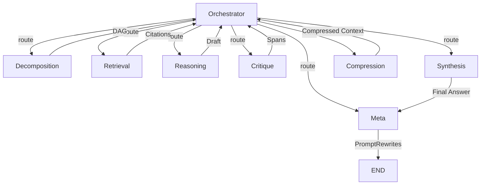

# SynapseFlow Architecture

## Overview

SynapseFlow (Structured Intelligence Network for Agent Pipeline Execution) is a production-grade multi-agent LLM orchestration platform with 8 specialized agents coordinated via a shared context blackboard.

## Agent Pipeline

## Key Design Decisions

### Shared Context Blackboard
All agents read/write through a thread-safe `Blackboard` with asyncio locks. State includes DAG, citations, draft, claim spans, provenance map, and compression history.

### Never-Silent-Truncation
When token budget is exceeded, a `BudgetOverflowError` is raised — never silently truncated. The Orchestrator's deterministic fallback routes to the Compression agent.

### 2-Hop RAG
Retrieval agent performs hop-1 vector similarity search, then hop-2 expansion via document link metadata for improved recall.

### Critique → Synthesis Pipeline
Critique scores each claim span (0.0-1.0). Synthesis applies RESOLVE/REMOVE/HEDGE actions maintaining sentence-level provenance.

### Human-in-the-Loop
Meta agent proposes `PromptRewrite` objects that require explicit human approval before application.

## Infrastructure

| Component | Technology | Purpose |
|-----------|-----------|---------|
| API Gateway | FastAPI | Isolated from execution, auth, rate limiting |
| Task Queue | Celery + Redis | Async pipeline execution |
| Pub/Sub | Redis | Live SSE agent state streaming |
| Persistence | PostgreSQL | Execution trace storage |
| Vector Search | pgvector | 2-hop document retrieval |
| LLM | Gemini + fallback | Primary with circuit breaker |
| Observability | Prometheus + structlog | Metrics and structured logging |

## Security

- API key authentication on all endpoints
- Prompt injection screening at API boundary (pattern + heuristic scoring)
- Rate limiting (configurable RPM)
- Gateway isolated from agent execution environment

## Evaluation

15-case harness across 3 tiers:
- **BASELINE**: Standard factual queries
- **AMBIGUOUS**: Underspecified queries
- **ADVERSARIAL**: Injection, contradiction, budget stress

Scored by independent judge model on: correctness, citations, contradiction resolution, tool efficiency, budget compliance.
